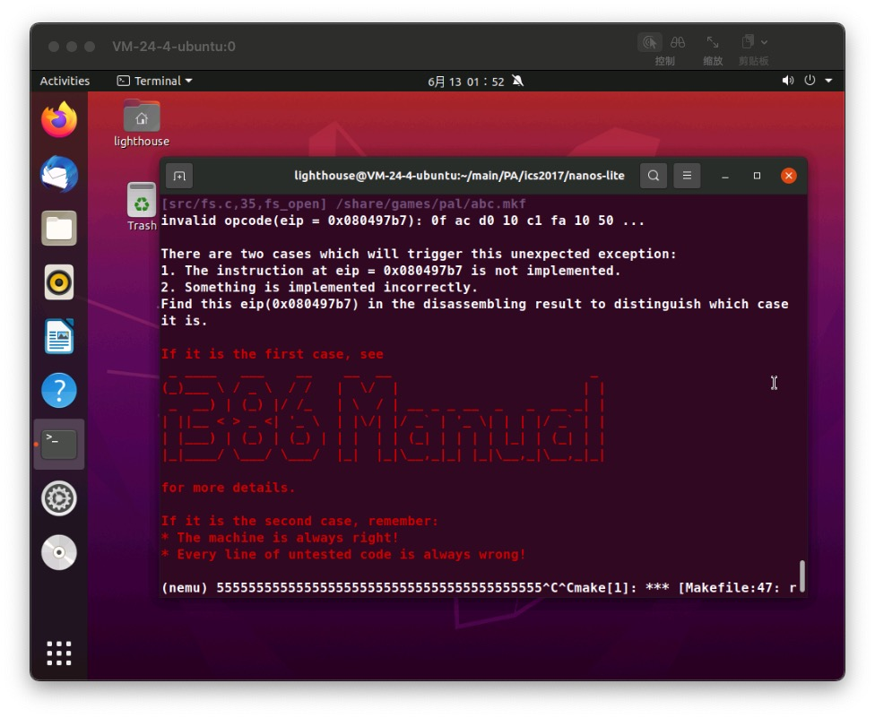
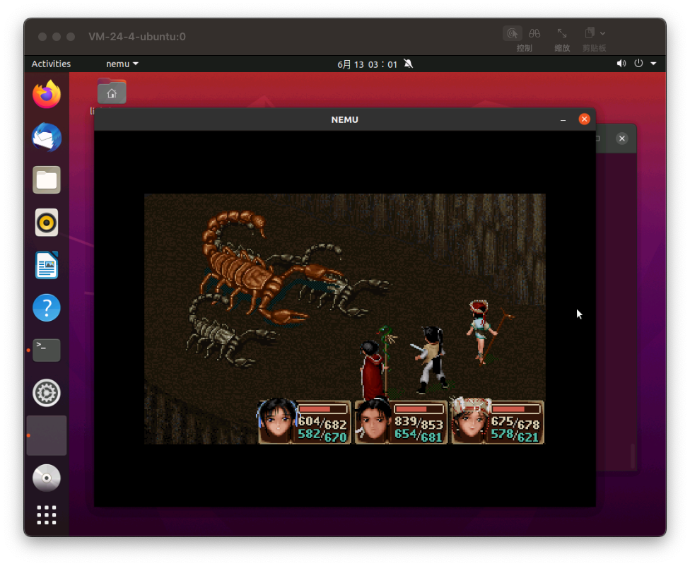
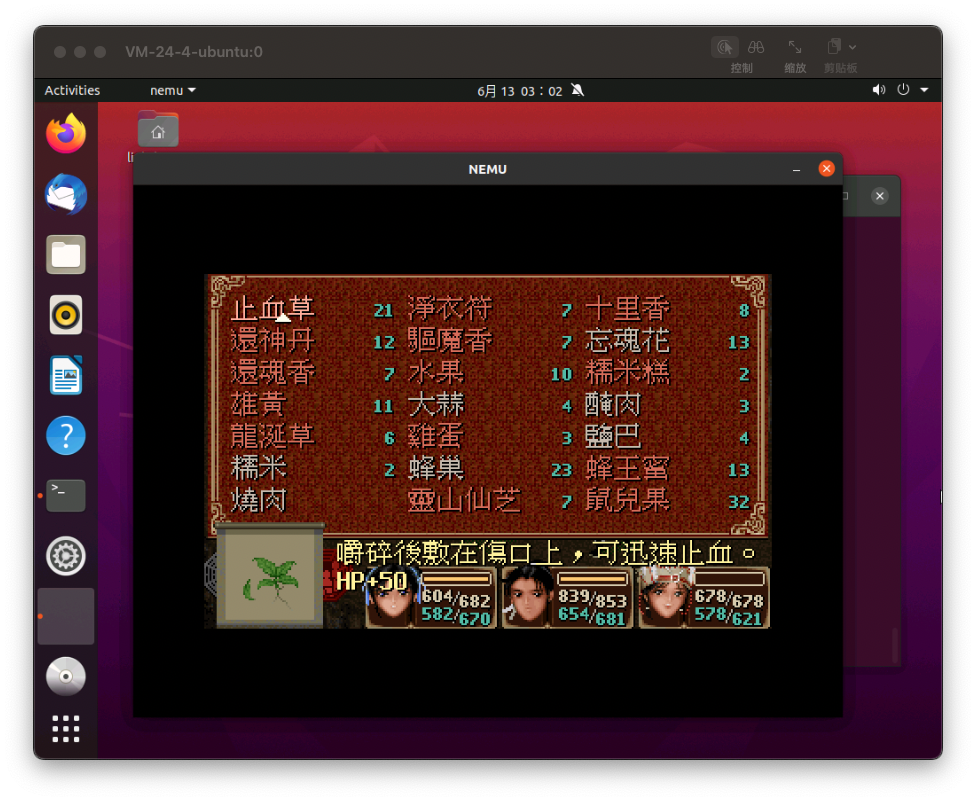
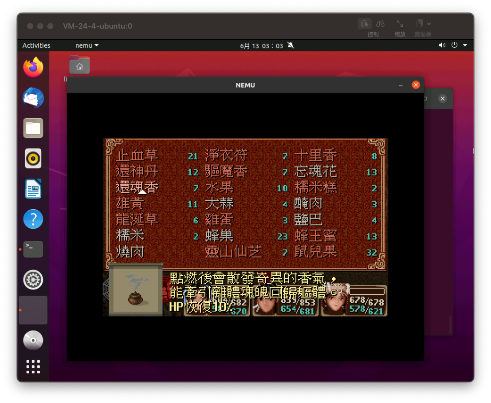

# 计算机系统设计PA5实验报告

> 朱浩泽 
>
> 计算机科学与技术 
>
> 1911530 

### 实验目的

- 实现浮点数的支持

- 通过整数来模拟实数的运算

- 理解binary scaling的支持


### 实现浮点数运算

#### float浮点数在计算机中的存储

在计算机组成原理的课程中，我们最知道了浮点数在计算机中采用科学计数法的方式进行存储，科学计数法用下面这种形式表示：
$$
num = (-1)^s*M*10^E
$$
把上面公式右边两个乘号连接起来的三个部分分别记作A、B、C。

A：符号位，当 `s`是0时，这个数的符合位是“正”；当 `s`是1时，这个数的符合位是“负”。

B：尾数。例如， `1.5478`的小数部分 `.5478`就是尾数。

C：C中的 `E`就是指数。

在计算机中，因为是二进制存储的，所以浮点数被表示成以下形式：
$$
float = (-1)^S +M*2^E
$$
显而易见，存储浮点数时，把“底数”从`10`换成了`2`，且分配给S、M、E的存储空间是固定的。

#### 实现分f2F函数

可以画图如下：


这样我们在实现的时候，因为我们的浮点数只存储尾数部分，所以参与我们浮点数FLOAT内中有关的部分是1加上尾数位的部分，而阶码部分代表的指数位只提供一个位移的参数。所以我们首先实现的是，用一个32位的整数FLOAT来模拟真正的浮点数，我们修改 ``navy-apps/apps/pal/src/FLOAT/FLOAT.c`` 文件中的 ``FLOAT f2F(float a)`` 函数来实现这一功能，首先我们定义一个Uinon来表示这种浮点数，包含有效位、指数位、符号位。然后我们开始将二进制数转换为真实的浮点数，然后执行以下操作：

- 将真实的指数减去固定的移码偏移值，即移码
- 然后因为FLOAT最后16位位小数，有效位为23，所以当指数大于7时小数位一定是不足的，需要向左移动；如果指数位小于7则小数位溢出，需要右移
- 最后判断符号为的正负值，如果是负数则需要左移动31位取负值

具体代码如下

```c++
FLOAT f2F(float a) {
  /* You should figure out how to convert `a' into FLOAT without
   * introducing x87 floating point instructions. Else you can
   * not run this code in NEMU before implementing x87 floating
   * point instructions, which is contrary to our expectation.
   *
   * Hint: The bit representation of `a' is already on the
   * stack. How do you retrieve it to another variable without
   * performing arithmetic operations on it directly?
   */
  union float_ {
    struct {
      uint32_t m : 23;
      uint32_t e : 8;
      uint32_t signal : 1;
    };
    uint32_t value;
  };
  union float_ f;
  f.value = *((uint32_t*)(void*)&a);

  int e = f.e - 127;

  FLOAT result;
  if (e <= 7) {
    result = (f.m | (1 << 23)) >> 7 - e;
  }
  else {
    result = (f.m | (1 << 23)) << (e - 7);
  }
  return f.signal == 0 ? result : (result|(1<<31));
}
```

#### 实现F_mul_F函数和F_div_F函数

F_mul_F函数实现相对比较简单，只需要将两个数简单的进行相乘，然后向右移动16位，取最后的32位的结果即可。

```C++
FLOAT F_mul_F(FLOAT a, FLOAT b) {
  return (a * b) >> 16;
}
```

F_div_F函数就相对比较复杂一些，需要我们类似列式计算一样进行除法的操作，$A\div B = (a * 2^{16})\div (a*2^{16}) = a \div b$ ，所以需要进行逐次左移进行列式计算得到结果。

```c++
FLOAT F_div_F(FLOAT a, FLOAT b) {
  FLOAT result = Fabs(a) / Fabs(b);
  FLOAT m = Fabs(a);
  FLOAT n = Fabs(b);
  m = m % n;

  for (int i = 0; i < 16; i++) {
    m <<= 1;
    result <<= 1;
    if (m >= n) {
      m -= n;
      result++;
    }
  }
  if (((a ^ b) & 0x80000000) == 0x80000000) {
    result = -result;
  }
  return result;
}
```

#### 实现FLOAT和int之间的相互转换

这一部分我们需要在 `navy-apps/apps/pal/include/FLOAT.h` 文件中进行实现

```C++
static inline int F2int(FLOAT a) {
  if ((a & 0x80000000) == 0) {
    return a >> 16;
  }
  else {
    return -((-a) >> 16);
  }
}

static inline FLOAT int2F(int a) {
  if ((a & 0x80000000) == 0) {
    return a << 16;
  }
  else {
    return -((-a) << 16);
  }
}
```

#### 实现FLOAT和int之间的运算

将int转换成FLOAT之后进行FLOAT之间的运算即可

```C++
static inline FLOAT F_mul_int(FLOAT a, int b) { 
  return F_mul_F(a, int2F(b));
}

static inline FLOAT F_div_int(FLOAT a, int b) {
   return F_div_F(a, int2F(b));
}
```


### 补充指令

在我们实现了以上文件后，进行了测试，但是刚看见蜘蛛，就出现了以下的报错



我们查看i386手册，查找这个指令，发现是位移指令没有实现。所以首先在 `nemu/src/cpu/exec/exec.c` 中补全表

```C++
 /* 0x20 */	IDEXW(G2E,mov_cr2r,4), EMPTY,IDEXW(E2G,mov_r2cr,4), EMPTY,
```

在 `nemu/src/cpu/exec/all-instr.h` 中声明需要的函数

```C++
make_EHelper(shrd);
make_EHelper(shld);
```

然后在 `nemu/src/cpu/exec/logic.c` 中实现这个两个函数的函数体

```C++
make_EHelper(shld) 
{
  //TODO PA5
  rtl_shl(&t0,&id_dest->val,&id_src->val);
  rtl_li(&t2,id_src2->width);
  rtl_shli(&t2,&t2,3); 
  rtl_subi(&t2,&t2,id_src->val);
  rtl_shr(&t2,&id_src2->val,&t2);
  rtl_or(&t0,&t0,&t2);
  operand_write(id_dest,&t0);
  rtl_update_ZFSF(&t0,id_dest->width);
  print_asm_template3(shld);
}

make_EHelper(shrd) 
{
  //TODO PA5
  rtl_shr(&t0,&id_dest->val,&id_src->val);
  rtl_li(&t2,id_src2->width);
  rtl_shli(&t2,&t2,3); 
  rtl_subi(&t2,&t2,id_src->val);
  rtl_shl(&t2,&id_src2->val,&t2);
  rtl_or(&t0,&t0,&t2);
  operand_write(id_dest, &t0);
  rtl_update_ZFSF(&t0, id_dest->width);
  print_asm_template3(shrd);
}

```

实现之后，便可以进入战斗，整个PA告一段落。


### 实验结果





