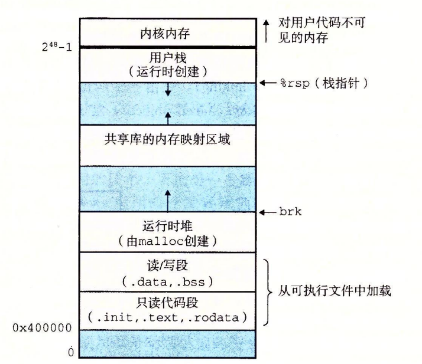

# 计算机系统设计平时作业五
> 朱浩泽 1911530 计算机科学与技术

### 请详细描述一下”加载器加载可执行文件的代码和数据到存储器“的过程

当加载器运行时会创建如下图所示的内存映像，在程序头部表的引导下，加载器将可执行文件的片复制到代码段和数据段。栈上的区域中有一部分是为内核中的代码和数据保留的，所谓内核就是操作系统驻留在内存的部分。运行时堆在数据段之后，通过调用 malloc 库往上增长。堆后面的区域是为共享模块保留的。用户栈总是从最大的合法用户地址开始向较小内存地址增长。在分配栈、共享库和堆段运行时地址的时候，链接器还会使用地址空间布局随机化。虽然每次程序运行时这些区域的地址都会改变，但它们的相对位置是不变的。具体来说就是loader会启动，通过mmap系统调用，将代码段和数据段映射到内存中，其实也就是为其分配了虚拟内存。此时，还不占用物理内存；当程序执行到了相应的地方，内核为其分配物理内存。loader会去查找该程序依赖的链接库，首先看该链接库是否被映射进内存中，如果没有使用mmap，将代码段与数据段映射到内存中，否则只是将其加入进程的地址空间，这样保证了某些库的内存地址空间是完全一样。

