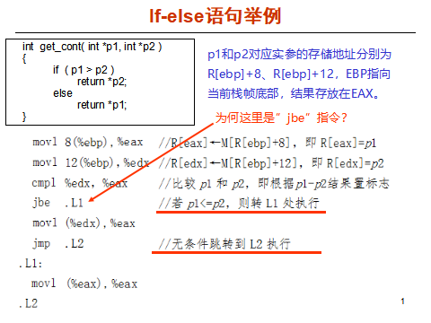

# 计算机系统设计平时作业四
> 朱浩泽 1911530 计算机科学与技术



当执行到 jbe 命令时，如果此时的 CF 标志位或者 ZF 标志位为1则跳转，其他不跳转，相当于小于等于命令。即执行到 cmp 命令时，如果此时的 edx 小于等于 eax，jbe 执行跳转指令。

我们使用如下程序测试单独的if语句

```c++
int main()
{
    int a, b;
    if(a > b) {
        a = 1;
        b = 2;
    }
}
```

使用gcc编译生成汇编代码如下：

```SAS
		movl    -8(%rbp), %eax
    cmpl    -4(%rbp), %eax
    jle .L2
    movl    $1, -8(%rbp)
    movl    $2, -4(%rbp)
.L2:
```

如果使用大于命令则会生成如下汇编代码

```SAS
		movl    -8(%rbp), %eax
    cmpl    -4(%rbp), %eax
		ja .L1
		jmp .L2
.L1:
		movl    $1, -8(%rbp)
    movl    $2, -4(%rbp)
.L2:
```

通过以上实验可以看出，使用jbe的相当于进行了一个小小的预判，其代码量明显小于使用ja指令的代码量，即如果if条件没有发生则直接跳过其指令执行else或下面的指令；如果发生直接执行结果然后进行跳转便可，处理器的流水线不会产生气泡造成资源浪费。

